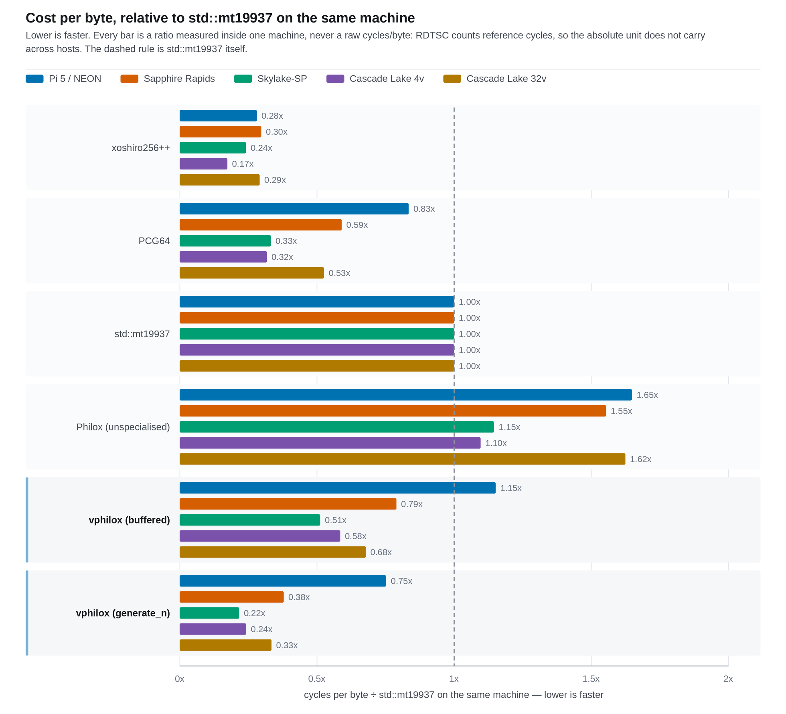
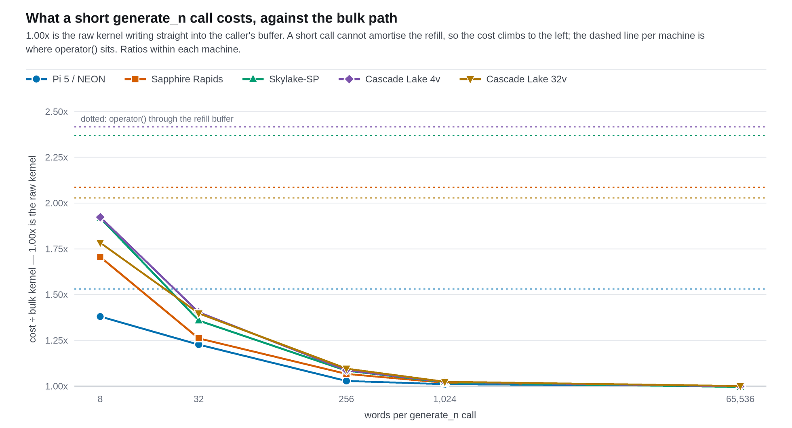
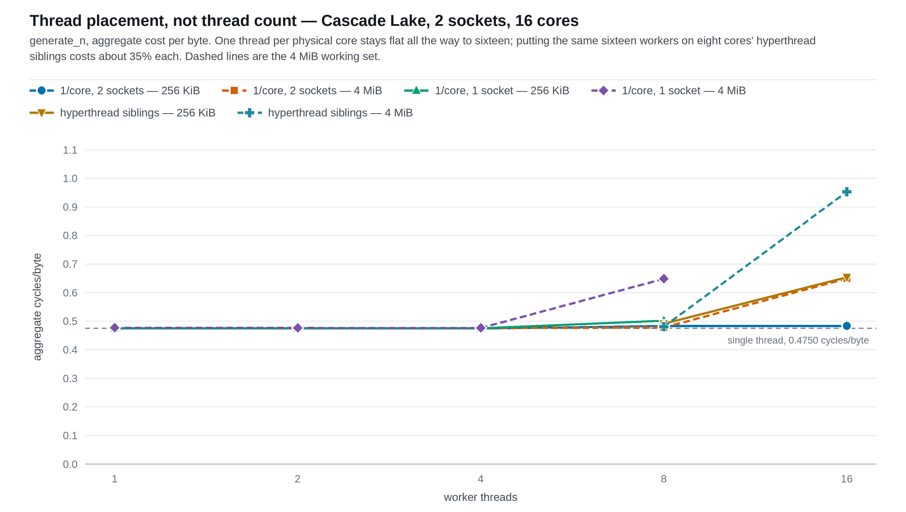
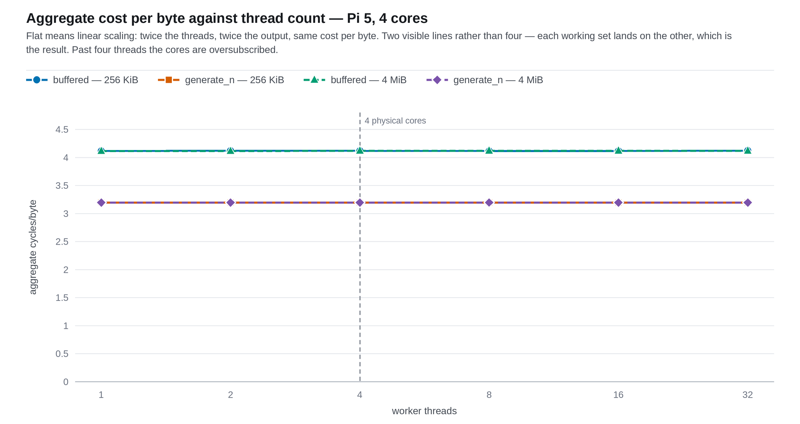
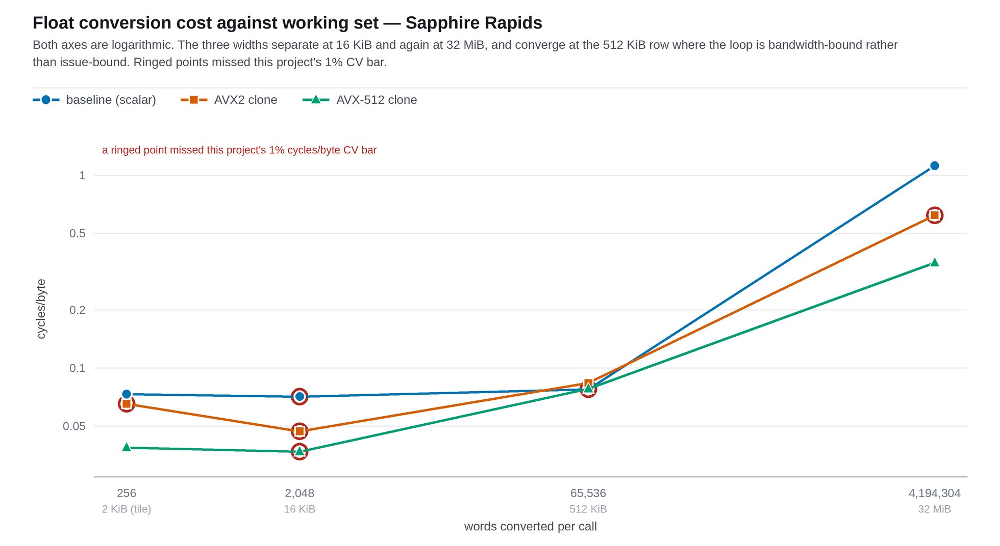

# Benchmark data

Every published figure and CSV here is generated from the raw JSON in
[`results/`](../../results) by one script:

```bash
python3 scripts/benchmarks/publish_results.py           # regenerate
python3 scripts/benchmarks/publish_results.py --check   # fail if stale
```

Standard library only — no matplotlib, no pip install. Each figure is written
three times, because the three formats have three jobs:

| File | For |
|---|---|
| `plots/<name>.png` | what you see below; GitHub renders it everywhere, no fonts needed |
| `plots/<name>.pdf` | the paper — `\includegraphics` takes PDF natively, and cannot take an SVG without `--shell-escape` and an Inkscape round trip |
| `plots/<name>.svg` | the source both of the above come from, and what `--check` polices |

The SVG and the PDF are both emitted as fixed-precision text by the script
itself, so regenerating with unchanged inputs produces an empty diff and
`--check` is safe to run in CI. The PNG is a rasterisation of the SVG, at 2x,
by whichever of `rsvg-convert`, Inkscape or Pillow is installed; it is the one
output `--check` ignores, because those renderers do not agree byte-for-byte
with each other or across their own versions.

Do not edit anything under `raw/` or `plots/` by hand. Add a run to `results/`
and re-run the script.

## The rule these figures follow

RDTSC counts **reference** cycles, not core cycles, and the Pi reads a
different counter entirely through `perf_event_open`. Cycles per byte therefore
compares *within* one machine and is meaningless across two with different
nominal frequencies.

So any figure spanning several machines plots a **ratio measured inside each
machine**, which is dimensionless and does transfer. Absolute cycles/byte
appears only in the CSVs, where the machine column travels beside it, and in
the three single-machine figures.

## Figures

### Throughput matrix — [`plots/matrix-relative.png`](plots/matrix-relative.png) · [PDF](plots/matrix-relative.pdf)



Cost per byte for each generator, divided by `std::mt19937` on the same
machine. Lower is faster.

|  | Pi 5 / NEON | Sapphire Rapids | Skylake-SP | Cascade Lake 4v | Cascade Lake 32v |
|---|---:|---:|---:|---:|---:|
| xoshiro256++ | 0.28x | 0.30x | 0.24x | 0.17x | 0.29x |
| PCG64 | 0.83x | 0.59x | 0.33x | 0.32x | 0.53x |
| `std::mt19937` | 1.00x | 1.00x | 1.00x | 1.00x | 1.00x |
| Philox, unspecialised | 1.65x | 1.55x | 1.15x | 1.10x | 1.62x |
| vphilox, `operator()` | 1.15x | 0.79x | 0.51x | 0.58x | 0.68x |
| **vphilox, `generate_n`** | **0.75x** | **0.38x** | **0.22x** | **0.24x** | **0.33x** |

The two Cascade Lake columns are the same part — family 6, model 85, stepping 7
— in a four-vCPU slice of a shared socket and on a whole two-socket host. They
are listed separately because cycles/byte does not transfer between machines,
and these behave as two machines: see
[`avx512-cascade-lake-2026-08-25.md`](avx512-cascade-lake-2026-08-25.md).

Three things this figure is for.

**The original objection.** vphilox was rejected upstream with "the performance
here is 1/10 of mt". Unspecialised Philox is 1.10-1.65x `std::mt19937` here —
not 10x, and within 10% of parity on the 4-vCPU Cascade Lake — and with the wide
multiplies specialised the bulk path is 0.22-0.75x it. That is the whole reason
the SIMD work exists.

**xoshiro256++ leads on four of the five.** It is ahead on the Pi, on Sapphire
Rapids and on both Cascade Lake hosts, though only by 1.15x on the 32-vCPU one.
On Skylake-SP `generate_n` is 0.4210 cycles/byte against xoshiro's 0.4703 —
vphilox wins that one part, on one machine. That is a result, not a trend, and
it does not change the guidance in `CLAUDE.md`: do not optimise toward xoshiro.
It is a latency-bound scalar chain, it offers none of the properties this
library exists for, and the comparison is here to be reported honestly rather
than chased.

**The buffer is the remaining cost.** The gap between the two vphilox rows is
the refill drain, and it widens as the kernel gets faster: 1.53x on the Pi,
2.03x on Cascade Lake 32v, 2.09x on Sapphire Rapids, 2.37x on Skylake-SP, 2.42x
on Cascade Lake 4v. The faster the kernel, the more the second pass over every
byte dominates.

### `generate_n` call size — [`plots/generate-n-sweep.png`](plots/generate-n-sweep.png) · [PDF](plots/generate-n-sweep.pdf)



What a small bulk call costs relative to the raw kernel on the same machine.
Eight words a call is 1.4-1.9x the kernel; by 256 words the remainder is a few
percent, and by 65536 it is gone. The two fastest kernels pay the most for a
call too small to amortise — 1.92x on Cascade Lake 4v and 1.78x on Cascade Lake
32v for an eight-word call — which is the same story as their buffer gaps. The
dashed line per machine is `operator()` through the refill buffer, which is what
a caller pays if they never reach for the bulk path.

This is the practical form of the buffer result above: `generate_n` recovers
essentially all of it, but only once the call is large enough to amortise the
setup.

### Thread placement — [`plots/scaling-placement.png`](plots/scaling-placement.png) · [PDF](plots/scaling-placement.pdf)



Cascade Lake, two sockets, sixteen physical cores — one machine, so cycles/byte
again. Where the threads sit matters more than how many there are. With one
thread per physical core the cost per byte is flat from 1 to 16 (0.4750 →
0.4833, +1.7%); put two workers on one core's hyperthread siblings and each
loses 35%. The dashed 4 MiB lines bend earlier and track footprint *per socket*
against the 33 MiB L3 rather than thread count. Frequency was measured directly
and is flat across the whole range, so none of the movement is turbo.

[`scaling-cascade-lake-2026-08-25.md`](scaling-cascade-lake-2026-08-25.md) is
the write-up. The short version for callers: **size a Philox thread pool by
physical cores, not by `hardware_concurrency()`.**

Two later studies on a bare-metal Tiger Lake laptop close the mechanism out, and
neither adds a figure — both are single contrasts, not curves.
[`icache-placement-tigerlake-2026-08-25.md`](icache-placement-tigerlake-2026-08-25.md)
rules out instruction supply: co-location costs 59% more per byte while i-cache
MPKI *falls* 36%, so the sibling threads are contending for execution ports and
not for the instruction cache.
[`openmp-runtime-tigerlake-2026-08-25.md`](openmp-runtime-tigerlake-2026-08-25.md)
re-runs the whole comparison under libgomp and finds it flat to one thread per
physical core where this project's own pool is not — so the flat result belongs
to the generator, not to `bench_scaling.cpp`.

### Thread scaling — [`plots/thread-scaling.png`](plots/thread-scaling.png) · [PDF](plots/thread-scaling.pdf)



Pi 5, four cores, one machine — so this one plots cycles/byte directly. Flat is
the claim: counter-based generation partitions with no shared state, so cost
per byte should not move with thread count, and across 1 to 32 threads and both
working sets it spans 0.063%. Beyond four threads throughput plateaus while
cost per byte still does not move, which is what running out of cores looks
like rather than running out of scaling.

Four series are drawn and two are visible: each working set lands on the other.

Four cores is too few to reach a knee, which is why the placement figure above
exists. The unpinned x86 curve in the same protocol does bend, but its CV rises
from under 1% to 3-5% at the same point — a scheduler result as much as a
generator one.

### Float conversion widths — [`plots/float-conversion-widths.png`](plots/float-conversion-widths.png) · [PDF](plots/float-conversion-widths.pdf)



Sapphire Rapids, one machine, log axes. The three ISA clones of the `u32 →
float` loop separate at 2 KiB (1.89x for AVX-512 at the 256-word tile the
library actually converts in), converge at 512 KiB where the loop is
bandwidth-bound and the width buys nothing, and separate again at 32 MiB
(3.19x). `!` marks a row above this project's 1% cycles/byte CV bar; the two
rows the conclusion rests on are not among them.

## CSVs

`raw/<tag>.csv` — one row per aggregated benchmark: median cycles/byte, the CV
as a percentage, bytes/second, median wall time, and which counter supplied the
cycles.

`raw/machines.csv` — one row per archived run: label, resolved backend,
measurement quality, CPU, reported MHz, cycle source, date, commit, governor,
compiler, and the verbatim command.

**`reported_mhz` is not a machine specification.** It is Google Benchmark's
`mhz_per_cpu`, the clock it observed when the run started, so on a machine with
a scaling governor at idle it can read an order of magnitude low: two Tiger Lake
runs say 400 and 421 MHz for a part whose base clock is 3100, next to sibling
runs of the same host on the same day saying 3090 and 3100. Nothing derived
depends on it — cycles/byte comes from RDTSC or `perf_event_open` inside the
benchmark, never from this column — so it is provenance, not input. For a
host's actual clock, read the write-up.

**Read the `quality` column before quoting a number.** Four archived runs do
not meet the bar in `CLAUDE.md` — an unpinned governor puts a moving turbo
ceiling directly into cycles/byte, a shared cloud vCPU hides steal time, and a
four-core desktop host cannot hold an unpinned 48-row curve quiet. They are kept
because they built the harness, and they are excluded from every figure above.

One further row is publishable but carries a warning in its own label:
`tigerlake-icache-ht` says *cycles/byte above CV bar*, because the finding it
supports is an i-cache miss rate rather than a throughput number. The quality
column is where that distinction lives — read it, do not infer it from the tag.

## Provenance

`bench_engines`, `bench_float`, `bench_scaling` and `bench_lane_layout` stamp
`vphilox_backend` and `vphilox_version` into the JSON `context` block, and
`run_matrix.sh` mirrors the backend into the environment file. Before that
existed the backend had to be recovered by hand from the write-up, and three
of the archived runs were measured on AVX-512 hardware while the AVX-512 kernel
was still a stub — so the CPU does not tell you what ran. Those runs carry a
curated backend in `publish_results.py`; everything recorded from here on is
derived from the JSON.

## The dated write-ups

The files beside this one are records of individual runs, kept at the date they
were taken rather than revised. Where a later result superseded one, the page
says so at the top instead of being edited to agree.
