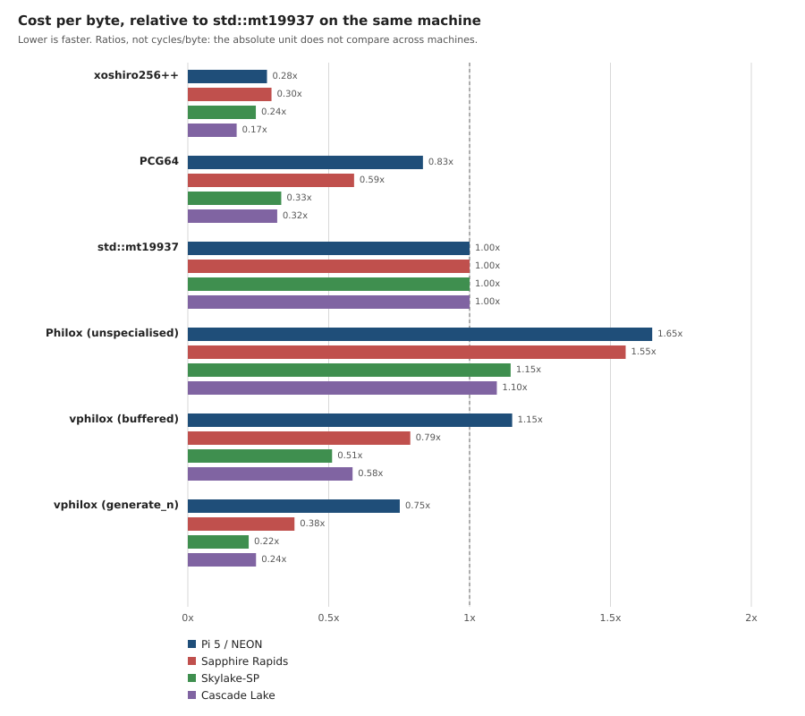
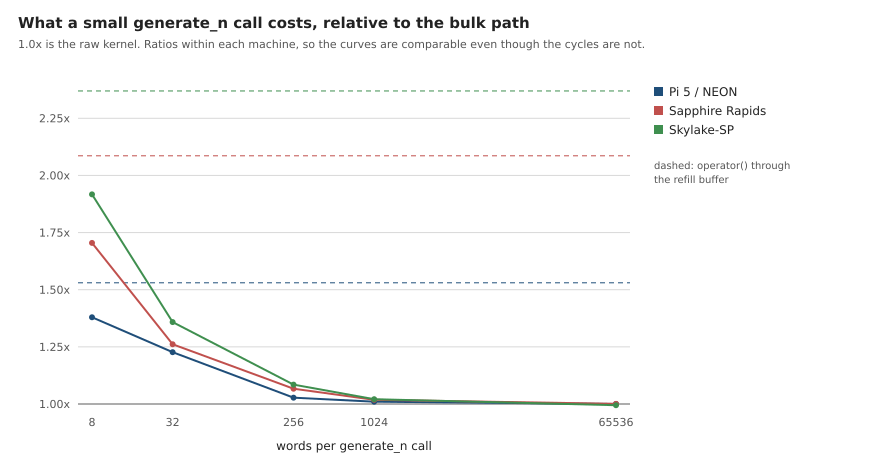
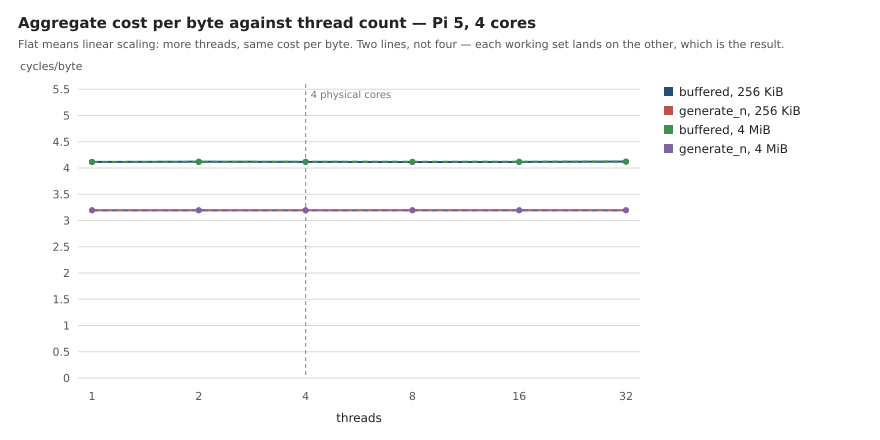
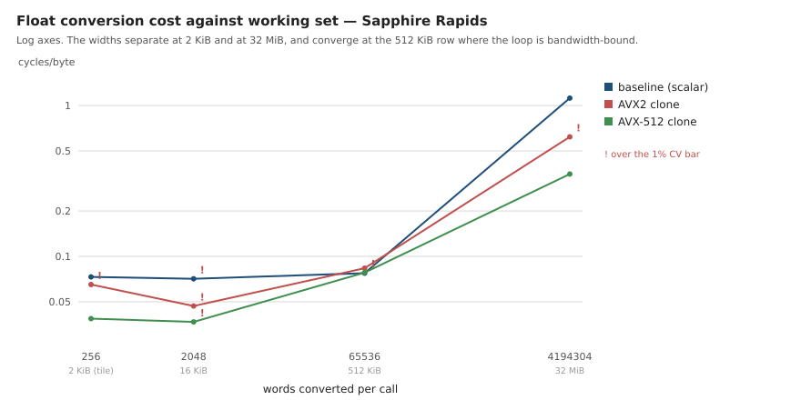

# Benchmark data

Every published figure and CSV here is generated from the raw JSON in
[`results/`](../../results) by one script:

```bash
python3 scripts/benchmarks/publish_results.py           # regenerate
python3 scripts/benchmarks/publish_results.py --check   # fail if stale
```

Standard library only — no matplotlib, no pip install. The SVGs are emitted as
sorted, fixed-precision text, so regenerating with unchanged inputs produces an
empty diff and `--check` is safe to run in CI.

Do not edit `raw/*.csv` or `plots/*.svg` by hand. Add a run to `results/` and
re-run the script.

## The rule these figures follow

RDTSC counts **reference** cycles, not core cycles, and the Pi reads a
different counter entirely through `perf_event_open`. Cycles per byte therefore
compares *within* one machine and is meaningless across two with different
nominal frequencies.

So any figure spanning several machines plots a **ratio measured inside each
machine**, which is dimensionless and does transfer. Absolute cycles/byte
appears only in the CSVs, where the machine column travels beside it, and in
the two single-machine figures.

## Figures

### Throughput matrix — [`plots/matrix-relative.svg`](plots/matrix-relative.svg)



Cost per byte for each generator, divided by `std::mt19937` on the same
machine. Lower is faster.

|  | Pi 5 / NEON | Sapphire Rapids | Skylake-SP | Cascade Lake |
|---|---:|---:|---:|---:|
| xoshiro256++ | 0.28x | 0.30x | 0.24x | 0.17x |
| PCG64 | 0.83x | 0.59x | 0.33x | 0.32x |
| `std::mt19937` | 1.00x | 1.00x | 1.00x | 1.00x |
| Philox, unspecialised | 1.65x | 1.55x | 1.15x | 1.10x |
| vphilox, `operator()` | 1.15x | 0.79x | 0.51x | 0.58x |
| **vphilox, `generate_n`** | **0.75x** | **0.38x** | **0.22x** | **0.24x** |

Three things this figure is for.

**The original objection.** vphilox was rejected upstream with "the performance
here is 1/10 of mt". Unspecialised Philox is 1.10-1.65x `std::mt19937` here —
not 10x, and within 10% of parity on Cascade Lake — and with the wide multiplies
specialised the bulk path is 0.22-0.75x it. That is the whole reason the SIMD
work exists.

**xoshiro256++ leads on three of the four.** It is ahead on the Pi, on Sapphire
Rapids and on Cascade Lake. On Skylake-SP `generate_n` is 0.4210 cycles/byte
against xoshiro's 0.4703 — vphilox wins that one part, on one machine. That is
a result, not a trend, and it does not change the guidance in `CLAUDE.md`: do
not optimise toward xoshiro. It is a latency-bound scalar chain, it offers none
of the properties this library exists for, and the comparison is here to be
reported honestly rather than chased.

**The buffer is the remaining cost.** The gap between the two vphilox rows is
the refill drain, and it widens as the kernel gets faster: 1.53x on the Pi,
2.09x on Sapphire Rapids, 2.37x on Skylake-SP, 2.42x on Cascade Lake. The
faster the kernel, the more the second pass over every byte dominates.

### `generate_n` call size — [`plots/generate-n-sweep.svg`](plots/generate-n-sweep.svg)



What a small bulk call costs relative to the raw kernel on the same machine.
Eight words a call is 1.4-1.9x the kernel; by 256 words the remainder is a few
percent, and by 65536 it is gone. Cascade Lake is the exception at 1.92x for an
eight-word call, which is the same story as its buffer gap: the fastest kernel
of the four pays the most for a call too small to amortise. The dashed line per machine is `operator()`
through the refill buffer, which is what a caller pays if they never reach for
the bulk path.

This is the practical form of the buffer result above: `generate_n` recovers
essentially all of it, but only once the call is large enough to amortise the
setup.

### Thread scaling — [`plots/thread-scaling.svg`](plots/thread-scaling.svg)



Pi 5, four cores, one machine — so this one plots cycles/byte directly. Flat is
the claim: counter-based generation partitions with no shared state, so cost
per byte should not move with thread count, and across 1 to 32 threads and both
working sets it spans 0.063%. Beyond four threads throughput plateaus while
cost per byte still does not move, which is what running out of cores looks
like rather than running out of scaling.

Four series are drawn and two are visible: each working set lands on the other.

### Float conversion widths — [`plots/float-conversion-widths.svg`](plots/float-conversion-widths.svg)



Sapphire Rapids, one machine, log axes. The three ISA clones of the `u32 →
float` loop separate at 2 KiB (1.89x for AVX-512 at the 256-word tile the
library actually converts in), converge at 512 KiB where the loop is
bandwidth-bound and the width buys nothing, and separate again at 32 MiB
(3.19x). `!` marks a row above this project's 1% cycles/byte CV bar; the two
rows the conclusion rests on are not among them.

## CSVs

`raw/<tag>.csv` — one row per aggregated benchmark: median cycles/byte, the CV
as a percentage, bytes/second, median wall time, and which counter supplied the
cycles.

`raw/machines.csv` — one row per archived run: label, resolved backend,
measurement quality, CPU, nominal MHz, cycle source, date, commit, governor,
compiler, and the verbatim command.

**Read the `quality` column before quoting a number.** Four archived runs do
not meet the bar in `CLAUDE.md` — an unpinned governor puts a moving turbo
ceiling directly into cycles/byte, and a shared cloud vCPU hides steal time.
They are kept because they built the harness, and they are excluded from every
figure above.

## Provenance

`bench_engines`, `bench_float`, `bench_scaling` and `bench_lane_layout` stamp
`vphilox_backend` and `vphilox_version` into the JSON `context` block, and
`run_matrix.sh` mirrors the backend into the environment file. Before that
existed the backend had to be recovered by hand from the write-up, and three
of the archived runs were measured on AVX-512 hardware while the AVX-512 kernel
was still a stub — so the CPU does not tell you what ran. Those runs carry a
curated backend in `publish_results.py`; everything recorded from here on is
derived from the JSON.

## The dated write-ups

The files beside this one are records of individual runs, kept at the date they
were taken rather than revised. Where a later result superseded one, the page
says so at the top instead of being edited to agree.
