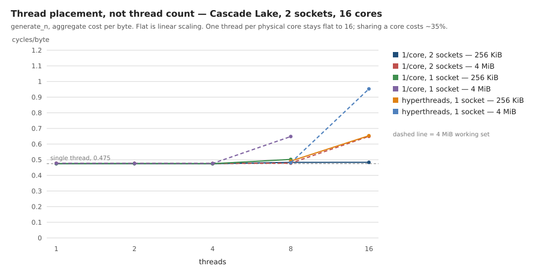

# Thread scaling on x86 — where the knee comes from, 2026-08-25

Issue #51 asks what causes the first scaling limit: memory bandwidth, false
sharing, scheduling, or something else. The Pi 5 curve
([`scaling-pi-2026-08-24.md`](scaling-pi-2026-08-24.md)) is flat across all four
of its cores and never reaches a knee, so it could not answer the question. This
run is on sixteen cores, and the knee is unambiguous.

**The answer: the first knee is hyperthread co-location, and it is not the
generator.** With one thread per *physical* core the aggregate cost per byte is
flat from 1 to 16 cores. Put two workers on one core's sibling threads and each
loses about a third. Memory is the *second* limit and depends on footprint per
socket rather than thread count. Frequency, which the benchmark's own header
warns is the obvious confound on x86, was measured directly and is not involved.

## Environment

| | |
|---|---|
| CPU | Intel Xeon @ 2.80 GHz, family 6 model 85 stepping 7 (Cascade Lake) |
| Instance | GCP `n2-standard-32`, `--min-cpu-platform="Intel Cascade Lake"`, `us-east1-b` |
| Topology | 2 sockets × 8 cores × 2 threads = 32 logical CPUs, 2 NUMA nodes |
| Caches | L1d 32 KiB/core, L2 1 MiB/core (16 MiB total), L3 33 MiB **per socket** |
| Backend | `avx512`, stamped into every JSON `context` |
| Compiler | GCC 13.3.0 |
| Commit | `35e08af` |

A whole two-socket host rather than a slice of one, which matters: the same
part in a 4-vCPU instance produced a result that did not reproduce here (see
[`avx512-cascade-lake-2026-08-25.md`](avx512-cascade-lake-2026-08-25.md)). The
instance was deleted after the run.

## The unpinned curve, and why it is not the answer

`scripts/benchmarks/run_matrix.sh --tag cascadelake-32v --bench scaling` runs
the documented protocol: no affinity, because pinning every worker to one core
would measure a context-switch storm. `generate_n`, aggregate cycles per byte:

| threads | 256 KiB/worker | CV | 4 MiB/worker | CV |
|---:|---:|---:|---:|---:|
| 1 | 0.4757 | 0.13% | 0.4778 | 0.08% |
| 2 | 0.4756 | 0.37% | 0.4770 | 0.15% |
| 4 | 0.4752 | 0.44% | 0.4765 | 0.14% |
| 8 | 0.4855 | 0.86% | 0.4818 | 0.60% |
| 16 | 0.6645 | 1.13% | 0.6763 | 4.52% |
| 32 | 0.6238 | 4.78% | 1.1160 | 3.27% |

There is a knee between 8 and 16 threads on both working sets. But the CV goes
from under 1% to 3–5% at exactly the same point, and **that is the tell**: the
scheduler is free to choose the placement, it does not choose the same one
twice, and the spread is the cost of the choices. A curve this noisy cannot
attribute its own knee. Everything below fixes the placement by hand.

## Placement, not thread count

Same binary, same benchmark, `taskset` deciding which CPUs exist. `generate_n`,
aggregate cycles per byte, nine repetitions:

| CPU set | threads | 256 KiB | 4 MiB |
|---|---:|---:|---:|
| `0-15` — one thread per physical core, both sockets | 1 | 0.4750 | 0.4770 |
| | 2 | 0.4754 | 0.4764 |
| | 4 | 0.4746 | 0.4759 |
| | 8 | 0.4831 | 0.4780 |
| | 16 | **0.4833** | 0.6495 |
| `0-7` — one thread per physical core, one socket | 8 | 0.5021 | 0.6483 |
| `0-7,16-23` — one socket's cores and their siblings | 8 | 0.4913 | 0.4804 |
| | 16 | **0.6536** | 0.9528 |
| `0-31` — every logical CPU | 16 | 0.6649 | 0.6108 |
| | 32 | 0.6154 | 1.1195 |

### The generator scales linearly to sixteen cores

The 256 KiB working set is L2-resident, so it takes the memory system out of
the picture and measures the generator. One thread per physical core:
**0.4750 → 0.4833 from 1 to 16 threads, a rise of 1.7%.** Sixteen independent
Philox streams over disjoint counter ranges cost what one costs. Aggregate
throughput is 29.25 GiB/s.

That also disposes of false sharing. Sixteen engines in sixteen separate heap
allocations, each `alignas(64)`, produce a flat line; if any of them straddled a
cache line with another the line would bend here and it does not.

### The first knee is a shared core

The two 16-thread rows in bold are the same sixteen workers, the same
L2-resident footprint, the same socket count for memory purposes, differing
only in whether each worker owns a core:

- sixteen physical cores: **0.4833**
- eight cores, sixteen hyperthreads: **0.6536**

**A shared core costs 35%.** That is what the unpinned run's 0.6645 at sixteen
threads is: the scheduler had 32 logical CPUs to choose from and put some pairs
of workers on sibling threads. It is also why the unpinned CV rises there —
different runs get different numbers of collisions.

The reason is that the Philox kernel is execution-port-bound rather than
latency-bound on this part. Each round is a pair of 32×32→64 multiplies, and
the sibling thread wants the same multiplier ports on the same cycle. A second
thread on a core adds throughput only where the first leaves issue slots idle,
and this kernel does not. Sixteen threads on eight cores produce 22.68 GiB/s
against 29.25 GiB/s for sixteen threads on sixteen cores — hyperthreading is a
net loss here, not merely a poor gain.

That is worth stating plainly for callers: **size a Philox thread pool by
physical cores, not by `hardware_concurrency()`.**

### Memory is the second limit, and it tracks footprint per socket

The 4 MiB working set is where the memory system enters. Reorganised by how
much each socket has to hold rather than by thread count:

| footprint per socket | placement | cycles/byte | vs 1 thread |
|---:|---|---:|---:|
| 16 MiB | 8 threads over 2 sockets | 0.4780 | 1.00x |
| 32 MiB | 8 threads on 1 socket | 0.6483 | 1.36x |
| 32 MiB | 16 threads over 2 sockets | 0.6495 | 1.36x |
| 64 MiB | 16 threads on 1 socket | 0.9528 | 2.00x |

Two placements with wildly different thread counts and socket counts — eight
threads on one socket, sixteen spread over two — land on 0.6483 and 0.6495.
What they share is 32 MiB per socket against a 33 MiB L3. The limit is the
last-level cache and the memory path behind it, and it is indifferent to how
many threads are asking.

NUMA is not a separate effect. Re-running the same placements under
`numactl --membind` moved nothing: 8 threads on node 0 went 0.6483 → 0.6383,
and 16 threads across both nodes 0.6495 → 0.6424, both inside the run-to-run
spread. First-touch had already put each worker's buffer on its own node.

**One cell does not fit.** Eight threads on the `0-7,16-23` set is also 32 MiB
on one socket and should read ~0.648; it read 0.4804, at 2.27% CV. The
difference between it and the `0-7` row is that the wider CPU set leaves the
pool's coordinator thread somewhere to run, which is a real effect at
`threads == cpus` — but that explains a few percent, not 26%. It is recorded
here unexplained rather than dropped.

### Frequency is not involved

The benchmark's header warns that RDTSC counts reference cycles, so a turbo
ceiling moving as threads are added lands directly in the cycles/byte column
and is indistinguishable from contention. On this host it was measured rather
than assumed, with the dependent-chain probe described in
[`avx512-cascade-lake-2026-08-25.md`](avx512-cascade-lake-2026-08-25.md):

| active cores | 1 | 4 | 8 | 16 | 32 |
|---|---:|---:|---:|---:|---:|
| core GHz under AVX-512 load | 3.371 | 3.366 | 3.368 | 3.366 | 3.158 |

**Flat to sixteen cores.** The knee between 8 and 16 threads happens at constant
frequency, so none of it is the clock. The drop at 32 is the probe's own core
being shared with a load thread — the same hyperthread effect the benchmark
measures, arriving in the instrument.

## Peak

The highest aggregate throughput seen on this host is **52.93 GiB/s** —
32 threads, 4 MiB each, every logical CPU. Cost per byte there is 1.1195,
2.36x the single-threaded figure, so more than half of each thread's work is
being spent on contention. The best *efficient* point is sixteen threads on
sixteen physical cores: 29.25 GiB/s at 0.4833 cycles/byte, within 2% of
single-threaded cost.

## What this changes

Nothing in the library. There is no synchronisation to remove and no false
sharing to fix — the counter-based design has no shared state by construction,
and the measurement confirms it. What changes is the guidance: pool size should
follow physical core count, and a working set that fits in the last-level cache
is worth arranging where the caller can.

The `bench_scaling` protocol keeps its unpinned default, which is right for a
scaling curve, but it now has a note that the curve above eight threads is a
scheduling result as much as a generator one.

## Artifacts

- [`results/cascadelake-32v-scaling.json`](../../results/cascadelake-32v-scaling.json)
  — the unpinned protocol run
- [`results/cascadelake-32v-placement-phys-2socket.json`](../../results/cascadelake-32v-placement-phys-2socket.json),
  [`-phys-1socket.json`](../../results/cascadelake-32v-placement-phys-1socket.json),
  [`-ht-1socket.json`](../../results/cascadelake-32v-placement-ht-1socket.json),
  [`-ht-2socket.json`](../../results/cascadelake-32v-placement-ht-2socket.json)
- [`results/cascadelake-32v-placement-environment.txt`](../../results/cascadelake-32v-placement-environment.txt)
  — provenance and the CPU-set definitions
- [`results/cascadelake-32v-frequency-probe.txt`](../../results/cascadelake-32v-frequency-probe.txt)
- [`scripts/benchmarks/freq_probe.cpp`](../../scripts/benchmarks/freq_probe.cpp)
